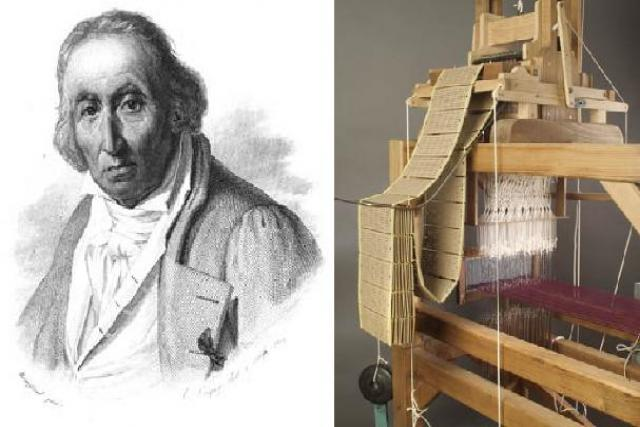

# ¿QUÉ ES EL MOVIMIENTO DE CONTROL?

El control de movimiento es una disciplina de la ingeniería que regula y coordina el desplazamiento de objetos mediante actuadores, sensores y algoritmos de control. Su aplicación es esencial en sectores como la manufactura, la robótica y la automatización de procesos. Es fundamental para garantizar precisión, eficiencia y optimización en sistemas industriales, mejorando la productividad y reduciendo errores. Su desarrollo ha permitido la evolución de máquinas inteligentes capaces de realizar operaciones con alta exactitud, impulsando la modernización y el avance tecnológico en diversas industrias.

## Indice

## 1. ¿En qué consiste?

El control de movimiento, también llamado control de posicionamiento servo, consite en el proceso de mover una carga en un sistema mecánico.

💡**Ejemplo 1:** Un ejemplo antiguo de control de movimiento es el telar Jacquard (1801). Este telar automatizado, desarrollado por Joseph Marie Jacquard, utilizaba tarjetas perforadas para controlar el movimiento de los hilos en la fabricación de textiles con patrones complejos.

<div align="center">
  
  <p><b>Figura 1.</b> Figura de prueba</p>
</div>

## Movimientos del telar Jacquard:

- **Movimiento de elevación de los hilos de urdimbre:**  
  - Se levantaban ciertos hilos según el patrón dictado por las tarjetas perforadas.
  - Este movimiento era clave para formar el diseño del tejido.

- **Movimiento del peine o batán:**  
  - Después de entrelazar los hilos, el peine golpeaba la trama para compactar el tejido.
  - Garantizaba que el tejido tuviera una estructura firme y uniforme.

- **Movimiento de avance de la tela:**  
  - A medida que se tejía, la tela se iba enrollando automáticamente.
  - Permitía la producción continua sin intervención manual.

- **Movimiento de las tarjetas perforadas:**  
  - Se desplazaban y giraban para indicar el siguiente patrón de tejido.
  - Funcionaban como un sistema de control programable mecánico.

## ¿Qué se controla?:

El control de movimiento puede regular posición, velocidad, torque y aceleración. Dependiendo de la aplicación, se pueden controlar las cuatro variables, solo tres, dos o una.

>🔑 *Posición:* Determina la ubicación exacta de un objeto en el espacio. Se controla para asegurar que un mecanismo llegue a un punto específico con precisión.
>
>🔑 *Velocidad:* Regula la rapidez con la que un objeto se mueve de un punto a otro. Es crucial para evitar vibraciones y mejorar la eficiencia del proceso.
>
>🔑 *Torque:* Es la fuerza de giro aplicada a un eje o motor. Controlarlo permite garantizar que un sistema pueda mover cargas sin sobrecargas o fallos mecánicos.
>
>🔑 *Acerleración:* Es la variación de la velocidad en el tiempo. Se controla para evitar movimientos bruscos y reducir el desgaste de los componentes.

💡**Ejemplo 2:** Controlando las 4 variables (posición, velocidad, torque y aceleración)

<div align="center">
  
  <p><b>Figura 2.</b> Robot  FANUC Arc Mate 100iC </p>
</div>

**Posición:** El brazo robótico debe moverse con precisión milimétrica para soldar en el punto exacto.

**Velocidad:** Se ajusta para evitar sobrecalentamiento o defectos en la soldadura.

**Torque:** Se controla para aplicar la presión adecuada en la unión de las piezas.

**Aceleración:** Se regula para evitar movimientos bruscos que puedan afectar la calidad de la soldadura.

💡**Ejemplo 3:** Controlando 3 variables (posición, velocidad y torque)

<div align="center">
  
  <p><b>Figura 3.</b> CNC de fresado Haas VF-2 </p>
</div>

**Posición:** La herramienta debe ubicarse exactamente en la coordenada correcta para realizar cortes precisos.

**Velocidad:** La velocidad de corte se ajusta según el material para evitar sobrecalentamiento o desgaste prematuro.

**Torque:** Se regula para asegurar la fuerza suficiente en el mecanizado sin dañar la pieza.

**Aceleración:** No se controla la aceleración directamente, ya que no es crítica para este proceso.

💡**Ejemplo 4:** Controlando 2 variables (posición y velocidad)

<div align="center">
  
  <p><b>Figura 3.</b> Cinta transportadora con parada automática ConveyLinx </p>
</div>

**Posición:** Se detiene exactamente en el punto donde debe descargarse un producto.

**Velocidad:** Se ajusta para sincronizarse con otras máquinas de la línea de producción.

**Torque:** No se controla el torque, porque la carga es liviana y no se requiere fuerza específica.

**Aceleración:** No se controla la aceleración, ya que no es relevante en este tipo de movimiento


## 3. Subsecciones
Las subsecciones pueden utilizarse para sub dividir ciertos temas que se tienen en clases, por ejemplo si se está trabajandolos conversores D/A, puede ser necesario subdividir este en circuito de resistencias ponderadas y circuito de escalera R2R. 
### 3.1. Título de subsecciones
Para la creación de estas subsecciones debe utilizar un tamaño de letra más pequeño, por lo tanto utilice la etiqueta '###' 
### 3.2. Numeración de subsecciones
Siga la numeración de la sección seguida de un punto y luego el número de la subsección.

## 4. Ejemplos
Si en algún caso pretende dar un ejemplo explicativo ya sea a través de texto o através de ecuaciones matemáticos, utilizar la palabra 'Ejemplo' seguido de una numeración consecutiva dentro de la clase. Utilice el emoji 💡 antecediendo la palabra.

## 5. Ecuaciones
Para la edición de ecuaciones debe utilizar la etiqueta '$$' al comienzo y final de la ecuación para que la ecuación quede centrada ocupando una línea. Si se quiere que la ecuación quede integrada en el texto debe utilizar la etiqueta '$' al comienzo y final de la ecuación. Las ecuaciones pueden ser editadas utilizando el código LATEX, en el siguiente enlace encuentran un editor de ecuaciones que les genera el código. http://www.alciro.org/tools/matematicas/editor-ecuaciones.jsp . Sin embargo hay muchas otras herramientas que pueden utilizar para esto.

💡**Ejemplo 1:** si se va a representar la ecuación de la ley de Ohm se puede mostrar así $R=\frac{V}{I}$ o también,

$$R=\frac{V}{I}$$

## 6. Figuras
Todas las figuras que incluya deben ser generadas por ustedes, **no utilizar las figuras de las presentaciones**. Para incluir figuras puede seguir los siguientes pasos:
* Primero escribimos .
* Después escribimos, dentro de los corchetes, el texto alternativo. Este es opcional y solo entra en acción cuando no se puede cargar la imagen correctamente.
* Después escribimos, dentro de los paréntesis, la ubicación del archivo (ya sea una url o una ubicación dentro de algun folder local). Se recomienda poner las imágenes en una carpeta que se llame imágenes dentro del repositorio github para que no tengan problemas al cargar las imágenes.

💡**Ejemplo 2:**


Figura 1. Figura de prueba

Incluya la respectiva etiqueta a modo de descripción de la figura y mantenga numeración consecutiva para todas las figuras de la clase.

## 7. Tablas
En caso de necesitar la inclusión de tablas para organizar información se recomienda el uso de la herramienta del siguiente enlace https://www.tablesgenerator.com/markdown_tables , la cual permite organizar la información dentro de la tabla y genera el código markdown automáticamente:

💡**Ejemplo 3:** 

| **Resultado** | **x = número de intentos hasta primer éxito** |
|---------------|-----------------------------------------------|
|       S       |                       1                       |
|       FS      |                       2                       |
|      FFS      |                       3                       |
|      ...      |                      ...                      |
|    FFFFFFS    |                       7                       |
|      ...      |                      ...                      |

Tabla 1. Tabla de ejemplo

Cada tabla debe llevar la etiqueta que describa su contenido y numeración consecutiva para todas las tablas

## 8. Código
Teniendo en cuenta que el curso requiere del desarrollo de código matlab, c, c++ u otro. Si requiere incluir pequeños segmentos de código en los apuntes hágalos de la siguiente manera:

💡**Ejemplo 4:**
```
var sumar2 = function(numero) {
  return numero + 2;
}
```

## 9. Ejercicios
Deben agregar 2 ejercicios con su respectiva solución, referentes a los temas tratados en cada una de las clases. Para agregar estos, utilice la etiqueta #, es decir como un nuevo título dentro de la clase con la palabra 'Ejercicios'. Cada uno de los ejercicios debe estar numerado y con su respectiva solución inmediatamente despues del enunciado. Antes del subtitulo de cada ejercicio incluya el emoji 📚

## 10. Conclusiones
Agregue unas breves conclusiones sobre los temas trabajados en cada clase, puede ser a modo de resumen de lo trabajado o a indicando lo aprendido en cada clase

## 11. Referencias
Agregue un subtítulo al final donde pueda poner todas las referencias consultadas incluyendo el origen o fuente de los ejercicios planteados. Tambien dentro del texto referencie los textos o artículos consultados y las figuras y tablas dentro de la explicación de las mismas.
